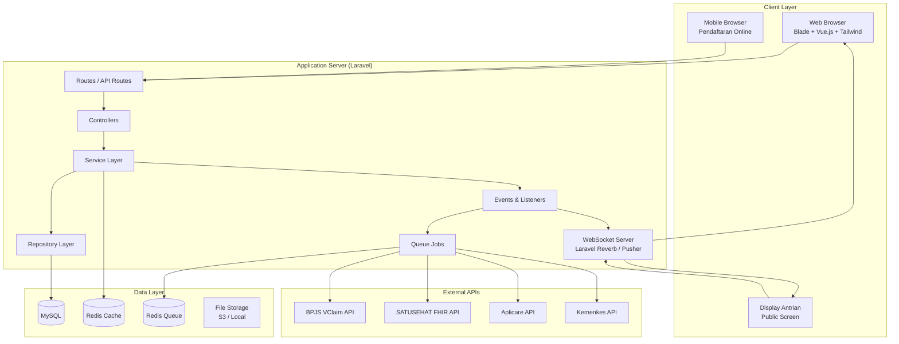
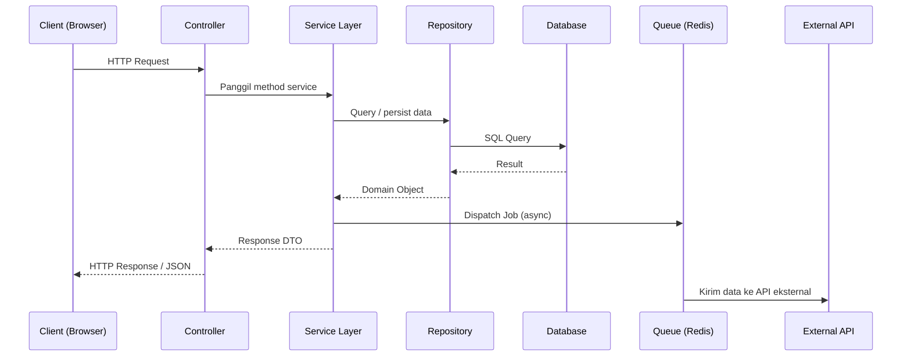
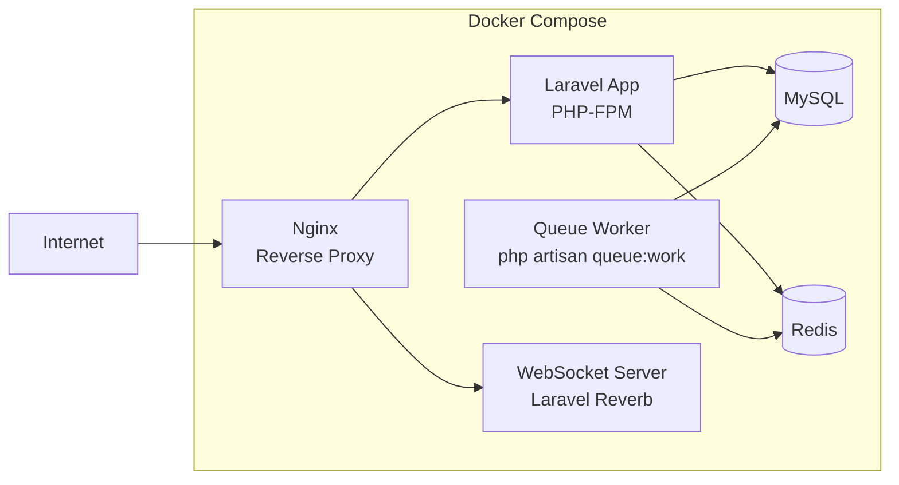
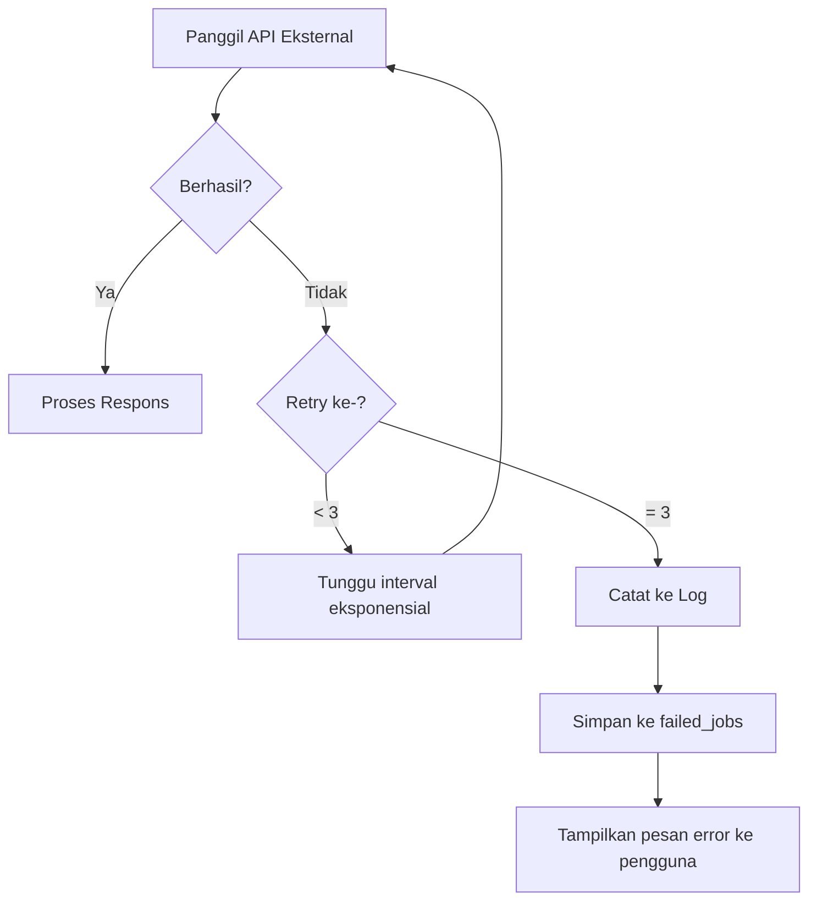

# Dokumen Desain Teknis: Aplikasi Rekam Medis Elektronik (RME)

## Ikhtisar (Overview)

Aplikasi Rekam Medis Elektronik (RME) adalah sistem informasi kesehatan berbasis web yang mengelola seluruh siklus pelayanan pasien — mulai dari pendaftaran, pemeriksaan klinis, farmasi, billing, hingga pelaporan ke instansi pemerintah. Sistem ini dibangun di atas framework Laravel dengan frontend Blade + Vue.js dan Tailwind CSS, menggunakan **MySQL** sebagai basis data utama, Redis untuk queue dan caching, serta WebSocket (Laravel Reverb/Pusher) untuk komunikasi real-time.

Sistem melayani tujuh peran pengguna: Admin, Dokter, Perawat, Farmasi, Kasir, Petugas Pendaftaran, dan Manajemen. Setiap peran memiliki akses yang dibatasi sesuai tanggung jawabnya.

Integrasi eksternal mencakup:
- **BPJS VClaim** — validasi peserta, penerbitan SEP, pengiriman klaim
- **SATUSEHAT (FHIR)** — sinkronisasi data kesehatan ke platform nasional Kemenkes
- **Aplicare** — sinkronisasi ketersediaan bed/kamar
- **INA-CBGs** — pengelompokan diagnosis untuk klaim rawat inap
- **Kemenkes** — pelaporan RL (Laporan Rumah Sakit)

---

## Arsitektur

### Pola Arsitektur

Sistem menggunakan arsitektur berlapis (layered architecture) dengan pola:

- **MVC (Model-View-Controller)** — Laravel sebagai backbone
- **Service Layer** — logika bisnis dienkapsulasi dalam Service class, terpisah dari Controller
- **Repository Pattern** — abstraksi akses data, memudahkan pengujian dan penggantian implementasi
- **Queue-based Async Processing** — integrasi eksternal dan operasi berat diproses secara asinkron via Redis Queue
- **Event-Driven** — perubahan status (antrian, bed, hasil lab) dipropagasi via Laravel Events + WebSocket

### Diagram Arsitektur Tingkat Tinggi



### Diagram Alur Request



### Deployment



---

## Komponen dan Antarmuka

### Struktur Direktori Laravel

```
app/
├── Http/
│   ├── Controllers/
│   │   ├── Auth/
│   │   ├── Registration/
│   │   ├── Queue/
│   │   ├── RME/
│   │   ├── Inpatient/
│   │   ├── Pharmacy/
│   │   ├── Billing/
│   │   ├── Lab/
│   │   ├── Radiology/
│   │   ├── Report/
│   │   ├── Online/
│   │   └── Settings/
│   ├── Middleware/
│   │   ├── PermissionMiddleware.php
│   │   ├── AuditTrailMiddleware.php
│   │   └── SessionTimeoutMiddleware.php
│   └── Requests/          # Form Request Validation
├── Services/
│   ├── AuthService.php
│   ├── PermissionService.php
│   ├── PatientService.php
│   ├── QueueService.php
│   ├── RMEService.php
│   ├── InpatientService.php
│   ├── PharmacyService.php
│   ├── BillingService.php
│   ├── LabService.php
│   ├── RadiologyService.php
│   ├── ReportService.php
│   ├── Integration/
│   │   ├── BPJSService.php
│   │   ├── SatuSehatService.php
│   │   ├── AplicareService.php
│   │   ├── KemenkesService.php
│   │   └── MockApiService.php
│   └── NotificationService.php
├── Repositories/
│   ├── Contracts/         # Interface definitions
│   └── Eloquent/          # Eloquent implementations
├── Models/
├── Jobs/
│   ├── SendBPJSClaimJob.php
│   ├── SyncSatuSehatJob.php
│   ├── SyncAplicareJob.php
│   ├── SendKemenkesReportJob.php
│   └── ExportReportJob.php
├── Events/
│   ├── QueueStatusUpdated.php
│   ├── BedStatusUpdated.php
│   ├── LabResultReady.php
│   └── RadiologyResultReady.php
├── Listeners/
└── Policies/              # Authorization policies per model
```

### Komponen Utama

#### 1. Auth Module
- `AuthController` — login, logout, session management
- `AuthService` — validasi kredensial, lockout logic, session timeout
- `PermissionService` — resolusi permission granular per user per menu/fitur
- Middleware: `PermissionMiddleware` (menggantikan `RoleMiddleware`), `SessionTimeoutMiddleware`
- Guard: session-based (web) + optional Sanctum token (API)

**Permission System:**
- Admin memiliki full akses ke semua menu dan fitur secara otomatis
- Hak akses role lain dikonfigurasi oleh Admin melalui menu Manajemen User
- Permission bersifat granular per menu/fitur (bukan hanya per role)
- Menu yang tidak memiliki izin akses disembunyikan sepenuhnya (hidden) dari navigasi — bukan disabled
- Permission di-cache per user untuk performa optimal

#### 2. Registration Module
- `RegistrationController` — pendaftaran pasien baru/lama
- `PatientService` — generate NoRM, validasi NIK unik
- `QueueService` — assign antrian ke poli
- Integrasi: `BPJSService::validatePeserta()`, `BPJSService::insertSEP()`

#### 3. Queue Module
- `QueueController` — manajemen antrian per poli
- `QueueService` — update status, panggil pasien
- Event: `QueueStatusUpdated` → broadcast via WebSocket
- Display publik: endpoint tanpa auth, subscribe channel WebSocket

#### 4. RME Module (Rawat Jalan & IGD)
- `RMEController` — CRUD rekam medis
- `RMEService` — validasi SOAP, validasi SKDP, generate resume
- Sub-form: SOAP, Keperawatan, Asesmen Awal, IGD, Penunjang, Tindakan

#### 5. Inpatient Module
- `InpatientController` — manajemen pasien rawat inap
- `BedManagementService` — status bed, penempatan pasien
- Event: `BedStatusUpdated` → broadcast + dispatch `SyncAplicareJob`

#### 6. Pharmacy Module
- `PharmacyController` — validasi resep, pengeluaran obat
- `PharmacyService` — cek stok, kurangi stok, alert kadaluarsa

#### 7. Billing Module
- `BillingController` — generate tagihan, proses pembayaran
- `BillingService` — kalkulasi tagihan, dispatch `SendBPJSClaimJob`

#### 8. Integration Services
Semua service integrasi mengimplementasikan interface `ExternalApiServiceInterface`:

```php
interface ExternalApiServiceInterface
{
    public function send(array $payload): ApiResponse;
    public function testConnection(): ConnectionTestResult;
    public function isTestingMode(): bool;
}
```

Setiap service integrasi mendukung dua mode operasi yang dikonfigurasi via API Settings:
- **Mode Production**: request dikirim ke URL endpoint produksi yang dikonfigurasi
- **Mode Testing**: request diarahkan ke URL sandbox atau ditangani oleh `MockApiService` — tidak ada request ke API produksi

```php
// Contoh resolusi mode di service
class BPJSService implements ExternalApiServiceInterface
{
    public function send(array $payload): ApiResponse
    {
        if ($this->isTestingMode()) {
            return $this->mockService->handle($payload);
        }
        return $this->httpClient->post($this->config->endpoint, $payload);
    }
}
```

Retry policy diimplementasikan via `RetryPolicy` class dengan exponential backoff.

#### 9. API Settings Module
- `ApiSettingsController` — CRUD konfigurasi API, dapat diakses melalui submenu "Setting API" di menu Master Data
- Field konfigurasi per integrasi: URL endpoint, consumer key, consumer secret, mode (testing/production)
- Enkripsi kredensial menggunakan Laravel `Crypt` facade sebelum disimpan
- `ConnectionTestService` — uji koneksi per integrasi (tombol "Test Koneksi")
- Indikator visual mode testing/production ditampilkan pada setiap konfigurasi
- `MockApiService` — menangani semua request saat mode testing aktif, mengembalikan mock response yang realistis per integrasi

---

## Model Data

### Diagram Entity-Relationship (Utama)

```mermaid
erDiagram
    USERS {
        bigint id PK
        string username UK
        string password
        string role
        boolean is_active
        datetime locked_until
        int failed_login_count
        timestamps
    }

    PERMISSIONS {
        bigint id PK
        string menu_key UK
        string menu_label
        string parent_key
        int sort_order
        timestamps
    }

    USER_PERMISSIONS {
        bigint id PK
        bigint user_id FK
        bigint permission_id FK
        boolean is_granted
        timestamps
    }

    PATIENTS {
        bigint id PK
        string no_rm UK
        string nama_lengkap
        date tanggal_lahir
        enum jenis_kelamin
        text alamat
        string nik_encrypted
        string no_telepon_encrypted
        string jenis_penjamin
        string no_bpjs
        string no_polis_asuransi
        string nama_asuransi
        timestamps
    }

    VISITS {
        bigint id PK
        string no_rawat UK
        bigint patient_id FK
        bigint poli_id FK
        bigint doctor_id FK
        bigint user_id FK
        enum jenis_penjamin
        string no_sep
        enum status
        date tanggal_kunjungan
        timestamps
    }

    MEDICAL_RECORDS {
        bigint id PK
        bigint visit_id FK
        text subjective
        text objective
        text assessment
        text plan
        bigint created_by FK
        timestamps
    }

    DIAGNOSES {
        bigint id PK
        bigint visit_id FK
        string icd10_code FK
        boolean is_primary
        timestamps
    }

    PROCEDURES {
        bigint id PK
        bigint visit_id FK
        string icd9cm_code FK
        bigint performed_by FK
        timestamps
    }

    PRESCRIPTIONS {
        bigint id PK
        bigint visit_id FK
        enum type
        enum status
        bigint prescribed_by FK
        timestamps
    }

    PRESCRIPTION_ITEMS {
        bigint id PK
        bigint prescription_id FK
        bigint drug_id FK
        decimal quantity
        string dosage
        string instructions
        timestamps
    }

    DRUG_STOCKS {
        bigint id PK
        bigint drug_id FK
        decimal quantity
        date expiry_date
        string batch_number
        decimal minimum_stock
        timestamps
    }

    BILLS {
        bigint id PK
        bigint visit_id FK
        decimal total_amount
        enum payment_method
        enum status
        string bpjs_claim_status
        timestamps
    }

    BILL_ITEMS {
        bigint id PK
        bigint bill_id FK
        string item_type
        bigint item_id
        string item_name
        decimal unit_price
        decimal quantity
        decimal subtotal
        timestamps
    }

    BEDS {
        bigint id PK
        bigint room_id FK
        string bed_code
        enum status
        bigint current_patient_id FK
        timestamps
    }

    ROOMS {
        bigint id PK
        string room_name
        enum class
        int capacity
        timestamps
    }

    AUDIT_TRAILS {
        bigint id PK
        bigint user_id FK
        string action
        string model_type
        bigint model_id
        json old_values
        json new_values
        string ip_address
        timestamps
    }

    API_SETTINGS {
        bigint id PK
        string integration_name UK
        string endpoint_url
        string sandbox_url
        text consumer_key_encrypted
        text consumer_secret_encrypted
        enum mode
        json additional_params
        boolean is_active
        timestamps
    }

    QUEUE_ENTRIES {
        bigint id PK
        bigint visit_id FK
        bigint poli_id FK
        int queue_number
        enum status
        timestamps
    }

    PATIENTS ||--o{ VISITS : "memiliki"
    VISITS ||--o| MEDICAL_RECORDS : "memiliki"
    VISITS ||--o{ DIAGNOSES : "memiliki"
    VISITS ||--o{ PROCEDURES : "memiliki"
    VISITS ||--o{ PRESCRIPTIONS : "memiliki"
    VISITS ||--o| BILLS : "memiliki"
    VISITS ||--o| QUEUE_ENTRIES : "memiliki"
    PRESCRIPTIONS ||--o{ PRESCRIPTION_ITEMS : "berisi"
    BILLS ||--o{ BILL_ITEMS : "berisi"
    ROOMS ||--o{ BEDS : "memiliki"
    USERS ||--o{ USER_PERMISSIONS : "memiliki"
    PERMISSIONS ||--o{ USER_PERMISSIONS : "diberikan ke"
```

### Tabel Master Data

| Tabel | Deskripsi |
|---|---|
| `polis` | Data poli/klinik |
| `sub_polis` | Sub poli |
| `doctors` | Data dokter (relasi ke users) |
| `specializations` | Spesialis |
| `sub_specializations` | Sub spesialis |
| `icd10_codes` | Kode diagnosa ICD-10 |
| `icd9cm_codes` | Kode tindakan ICD-9 CM |
| `drugs` | Master obat |
| `drug_units` | Satuan obat |
| `drug_categories` | Kategori obat |
| `suppliers` | Supplier obat |
| `action_masters` | Master tindakan medis |
| `action_tariffs` | Tarif tindakan per jenis penjamin |
| `doctor_schedules` | Jadwal praktik dokter |
| `examination_types` | Jenis pemeriksaan penunjang |
| `permissions` | Daftar menu/fitur yang dapat dikonfigurasi aksesnya |
| `user_permissions` | Mapping permission per user (granular) |

### Enkripsi Data Sensitif

Field sensitif pasien dienkripsi menggunakan Laravel `Crypt` (AES-256-CBC) sebelum disimpan:
- `nik_encrypted` ← NIK pasien
- `no_telepon_encrypted` ← nomor telepon
- `alamat` ← alamat (opsional, tergantung kebijakan)

Kredensial API eksternal di tabel `api_settings`:
- `consumer_key_encrypted`
- `consumer_secret_encrypted`

### Caching Strategy

| Data | Cache Key | TTL |
|---|---|---|
| Data peserta BPJS | `bpjs:peserta:{no_kartu}` | 1 jam |
| Jadwal dokter | `schedule:doctor:{id}:{date}` | 15 menit |
| Slot antrian tersedia | `queue:slot:{poli_id}:{date}` | 5 menit |
| Konfigurasi API | `api_settings:{integration}` | 10 menit |
| Permission user | `permissions:user:{user_id}` | 5 menit |


---

## Properti Kebenaran (Correctness Properties)

*Sebuah properti adalah karakteristik atau perilaku yang harus berlaku pada semua eksekusi sistem yang valid — pada dasarnya, pernyataan formal tentang apa yang seharusnya dilakukan sistem. Properti berfungsi sebagai jembatan antara spesifikasi yang dapat dibaca manusia dan jaminan kebenaran yang dapat diverifikasi oleh mesin.*

### Property 1: Autentikasi hanya menerima kredensial valid

*Untuk sembarang* kombinasi username dan password, sistem hanya boleh membuat sesi aktif jika dan hanya jika kombinasi tersebut cocok dengan data pengguna yang terdaftar dan aktif di sistem.

**Validates: Requirements 1.1, 1.4**

---

### Property 2: Akun terkunci setelah 5 kali gagal login

*Untuk sembarang* akun pengguna yang valid, setelah tepat 5 kali percobaan login dengan kredensial salah secara berturut-turut, akun tersebut harus terkunci dan tidak dapat digunakan untuk login selama 15 menit berikutnya.

**Validates: Requirements 1.5**

---

### Property 3: Permission granular menentukan visibilitas menu

*Untuk sembarang* pengguna non-Admin, setiap menu atau fitur yang tidak memiliki izin akses yang diberikan oleh Admin harus disembunyikan sepenuhnya dari navigasi — tidak boleh muncul dalam bentuk apapun (hidden, bukan disabled).

**Validates: Requirements 1.6, 1.7**

---

### Property 4: Setiap aksi pengguna tercatat di audit trail

*Untuk sembarang* aksi pengguna yang terautentikasi (login, logout, baca rekam medis, ubah data, hapus data), sistem harus membuat entri audit trail yang berisi: identitas pengguna, jenis aksi, model yang terpengaruh, nilai sebelum dan sesudah perubahan (jika ada), waktu kejadian, dan alamat IP.

**Validates: Requirements 1.9, 20.4**

---

### Property 5: NoRM yang dihasilkan selalu unik

*Untuk sembarang* jumlah pendaftaran pasien baru yang dilakukan secara berurutan maupun bersamaan, semua NoRM yang dihasilkan oleh sistem harus unik satu sama lain — tidak ada dua pasien yang memiliki NoRM yang sama.

**Validates: Requirements 3.3**

---

### Property 6: NoRawat yang dihasilkan selalu unik

*Untuk sembarang* jumlah kunjungan pasien yang didaftarkan, semua NoRawat yang dihasilkan oleh sistem harus unik satu sama lain — tidak ada dua kunjungan yang memiliki NoRawat yang sama.

**Validates: Requirements 3.9**

---

### Property 7: Pendaftaran BPJS valid selalu menghasilkan SEP

*Untuk sembarang* data pasien BPJS yang lolos validasi keaktifan peserta dari VClaim, proses pendaftaran harus selalu menghasilkan SEP melalui endpoint VClaim /SEP/insert sebelum pendaftaran dinyatakan selesai.

**Validates: Requirements 3.7**

---

### Property 8: Pendaftaran selesai selalu menghasilkan entri antrian

*Untuk sembarang* pendaftaran pasien yang berhasil diselesaikan, sistem harus secara otomatis membuat entri antrian di poli yang dipilih dengan status awal "menunggu".

**Validates: Requirements 3.10**

---

### Property 9: Perubahan status antrian selalu memicu event WebSocket

*Untuk sembarang* perubahan status antrian pasien (menunggu → dipanggil → dalam pemeriksaan → selesai), sistem harus mengirimkan event broadcast WebSocket dengan data antrian terbaru ke channel poli yang bersangkutan.

**Validates: Requirements 4.2**

---

### Property 10: Rekam medis tanpa diagnosa ICD-10 ditolak

*Untuk sembarang* data rekam medis rawat jalan atau rawat inap yang tidak memiliki minimal satu diagnosa ICD-10, operasi penyimpanan harus ditolak dengan pesan validasi yang informatif.

**Validates: Requirements 5.5**

---

### Property 11: Penempatan pasien di bed selalu mendispatch job sinkronisasi Aplicare

*Untuk sembarang* operasi penempatan pasien di bed, sistem harus mendispatch job sinkronisasi ke queue Aplicare secara asinkron — bukan memblokir respons HTTP untuk menunggu konfirmasi dari Aplicare.

**Validates: Requirements 7.3**

---

### Property 12: Retry policy diterapkan konsisten untuk semua kegagalan API eksternal

*Untuk sembarang* kegagalan panggilan ke API eksternal (BPJS VClaim, SATUSEHAT, Aplicare, Kemenkes) akibat timeout atau error jaringan, sistem harus melakukan retry maksimal 3 kali dengan interval eksponensial, mencatat setiap kegagalan ke log, dan menampilkan pesan error informatif setelah semua retry habis.

**Validates: Requirements 7.4, 13.6**

---

### Property 13: Validasi resep selalu memeriksa stok sebelum konfirmasi

*Untuk sembarang* resep yang divalidasi oleh Petugas Farmasi, sistem harus selalu memeriksa ketersediaan stok untuk setiap item obat dalam resep sebelum konfirmasi — tidak ada konfirmasi resep yang melewati pengecekan stok.

**Validates: Requirements 10.2**

---

### Property 14: Penyerahan obat selalu mengurangi stok secara akurat

*Untuk sembarang* penyerahan obat kepada pasien dengan jumlah N unit, stok obat tersebut harus berkurang tepat N unit setelah transaksi selesai — tidak lebih, tidak kurang.

**Validates: Requirements 10.4**

---

### Property 15: Obat dengan stok di bawah minimum selalu ditandai peringatan

*Untuk sembarang* obat yang memiliki jumlah stok saat ini kurang dari atau sama dengan nilai minimum_stock yang dikonfigurasi, sistem harus menandai obat tersebut dengan status "stok menipis" yang terlihat pada antarmuka farmasi.

**Validates: Requirements 10.6**

---

### Property 16: Obat kadaluarsa tidak dapat dikeluarkan

*Untuk sembarang* obat yang tanggal kadaluarsanya sudah terlewati (expiry_date < tanggal hari ini), sistem harus menolak setiap operasi pengeluaran obat tersebut kepada pasien.

**Validates: Requirements 10.8**

---

### Property 17: Total tagihan sama dengan jumlah semua item layanan

*Untuk sembarang* kombinasi tindakan medis, obat, dan layanan yang diterima pasien selama kunjungan, total tagihan yang dihasilkan harus sama persis dengan jumlah (sum) dari semua item tagihan individual.

**Validates: Requirements 11.1**

---

### Property 18: Data peserta BPJS yang berhasil diambil selalu di-cache

*Untuk sembarang* data peserta BPJS yang berhasil diambil dari API VClaim, data tersebut harus tersimpan di cache dengan TTL tepat 1 jam menggunakan key yang konsisten berdasarkan nomor kartu peserta.

**Validates: Requirements 13.2**

---

### Property 19: FHIR Resource invalid tidak dikirim ke SATUSEHAT

*Untuk sembarang* FHIR Resource (Patient, Encounter, Condition, Observation, Medication) yang tidak memenuhi struktur FHIR yang valid, sistem harus menolak pengiriman ke platform SATUSEHAT dan mencatat error validasi ke log — tanpa melakukan HTTP request ke API SATUSEHAT.

**Validates: Requirements 14.8**

---

### Property 20: Ekspor laporan besar selalu diproses secara asinkron

*Untuk sembarang* permintaan ekspor laporan yang menghasilkan lebih dari 1000 baris data, sistem harus mendispatch job ekspor ke queue (bukan memproses secara synchronous) dan mengembalikan respons HTTP segera kepada pengguna.

**Validates: Requirements 17.5**

---

### Property 21: Data sensitif pasien selalu tersimpan terenkripsi

*Untuk sembarang* data pasien yang disimpan ke database, field sensitif (NIK, nomor telepon) harus tersimpan dalam bentuk terenkripsi — nilai plaintext tidak boleh ditemukan di kolom database yang bersangkutan.

**Validates: Requirements 20.1**

---

### Property 22: Kredensial API eksternal selalu tersimpan terenkripsi

*Untuk sembarang* konfigurasi API eksternal yang disimpan melalui API Settings Module, nilai consumer_key dan consumer_secret harus tersimpan dalam bentuk terenkripsi di database — nilai plaintext tidak boleh ditemukan di kolom tersebut.

**Validates: Requirements 21.3**

---

### Property 25: Mode testing mencegah request ke API produksi

*Untuk sembarang* integrasi API yang dikonfigurasi dalam mode testing, semua request yang dipicu oleh sistem harus ditangani oleh mock service atau diarahkan ke URL sandbox — tidak ada HTTP request yang dikirimkan ke URL endpoint produksi.

**Validates: Requirements 13.10, 14.9, 15.5, 21.9**

---

### Property 23: Validasi data master menolak input tidak lengkap atau duplikat

*Untuk sembarang* data master baru yang memiliki field wajib kosong atau nilai yang sudah ada di database (duplikat pada field unik), sistem harus menolak penyimpanan dan mengembalikan pesan validasi yang spesifik.

**Validates: Requirements 2.2**

---

### Property 24: Data master yang direferensikan tidak dapat dihapus

*Untuk sembarang* data master yang memiliki minimal satu referensi aktif di tabel transaksi (kunjungan, resep, tagihan, dll.), operasi penghapusan harus ditolak dengan pesan yang menjelaskan mengapa penghapusan tidak dapat dilakukan.

**Validates: Requirements 2.3**

---

## Penanganan Error

### Strategi Umum

Semua error ditangani secara terpusat melalui Laravel Exception Handler (`app/Exceptions/Handler.php`) dengan respons yang konsisten:

```json
{
  "success": false,
  "message": "Pesan error yang dapat dibaca pengguna",
  "error_code": "KODE_ERROR_SPESIFIK",
  "details": {}
}
```

### Kategori Error dan Penanganan

| Kategori | Contoh | Penanganan |
|---|---|---|
| Validasi Input | Field wajib kosong, format tidak valid | HTTP 422, pesan per field |
| Autentikasi | Token expired, sesi tidak valid | HTTP 401, redirect ke login |
| Otorisasi | Akses resource tidak diizinkan | HTTP 403, log audit |
| Not Found | Pasien/kunjungan tidak ditemukan | HTTP 404, pesan informatif |
| Konflik Data | Duplikat NoRM, referensi aktif | HTTP 409, pesan informatif |
| API Eksternal | Timeout, error jaringan | Retry + log + notifikasi user |
| Server Error | Exception tidak terduga | HTTP 500, log detail, notifikasi admin |

### Penanganan Error Integrasi Eksternal



**Interval Retry Eksponensial:**
- Retry 1: 1 menit
- Retry 2: 5 menit
- Retry 3: 15 menit

### Circuit Breaker

Untuk API BPJS dan SATUSEHAT yang kritikal, implementasikan circuit breaker sederhana:
- Setelah 10 kegagalan dalam 5 menit, circuit "terbuka" selama 30 menit
- Selama circuit terbuka, request langsung gagal tanpa mencoba API
- Setelah 30 menit, circuit "setengah terbuka" untuk mencoba satu request

### Penanganan Kegagalan Queue

- Job yang gagal setelah semua retry tersimpan di tabel `failed_jobs`
- Admin dapat melihat dan me-retry failed jobs melalui dashboard
- Alert otomatis dikirim ke admin jika jumlah failed jobs melebihi threshold

---

## Strategi Pengujian

### Pendekatan Dual Testing

Sistem menggunakan dua pendekatan pengujian yang saling melengkapi:

1. **Unit Test / Example-based Test** — memverifikasi perilaku spesifik dengan contoh konkret
2. **Property-based Test** — memverifikasi properti universal yang harus berlaku untuk semua input valid

### Library Property-Based Testing

Karena sistem dibangun dengan PHP/Laravel, digunakan library **[Eris](https://github.com/giorgiosironi/eris)** (PHP property-based testing library) atau alternatifnya **[PHPCheck](https://github.com/igorw/phpcheck)**. Setiap property test dikonfigurasi untuk menjalankan minimum **100 iterasi**.

Format tag untuk setiap property test:
```
Feature: electronic-medical-records, Property {nomor}: {teks properti}
```

### Unit Tests

Fokus unit test:
- Validasi input (Form Request classes)
- Logika kalkulasi tagihan
- Generator NoRM dan NoRawat
- Mapping kode FHIR
- Enkripsi/dekripsi data sensitif
- State machine status antrian dan bed

### Property Tests

Setiap properti dari bagian Correctness Properties diimplementasikan sebagai satu property-based test:

```php
// Contoh: Property 5 - NoRM unik
/**
 * Feature: electronic-medical-records, Property 5: NoRM yang dihasilkan selalu unik
 */
public function testNoRMIsAlwaysUnique(): void
{
    $this->forAll(
        Generator\choose(2, 100) // jumlah pasien baru
    )->then(function (int $count) {
        $noRMs = [];
        for ($i = 0; $i < $count; $i++) {
            $noRMs[] = $this->patientService->generateNoRM();
        }
        $this->assertCount($count, array_unique($noRMs));
    });
}
```

### Integration Tests

Fokus integration test:
- Alur pendaftaran pasien end-to-end (dengan mock BPJS via MockApiService)
- Alur pembuatan rekam medis hingga billing
- Sinkronisasi WebSocket untuk antrian dan bed
- Retry mechanism untuk API eksternal
- Ekspor laporan asinkron
- Verifikasi mode testing: semua integrasi API tidak mengirim request ke produksi saat mode testing aktif
- Verifikasi permission system: menu tersembunyi untuk user tanpa izin

### Smoke Tests

Dijalankan setelah deployment:
- Semua akun default tersedia untuk setiap peran
- Semua tabel master data memiliki seed data
- Semua endpoint API dapat diakses
- Koneksi database dan Redis berfungsi

### Test Coverage Target

| Layer | Target Coverage |
|---|---|
| Service Layer | ≥ 80% |
| Repository Layer | ≥ 70% |
| Controller Layer | ≥ 60% |
| Integration Services | ≥ 75% (dengan mock) |

### Pengujian Keamanan

- Verifikasi enkripsi field sensitif di database (bukan plaintext)
- Verifikasi HTTPS enforced di semua endpoint
- Verifikasi rate limiting pada endpoint login
- Verifikasi audit trail terbuat untuk semua operasi sensitif
- Penetration testing dasar untuk SQL injection dan XSS
